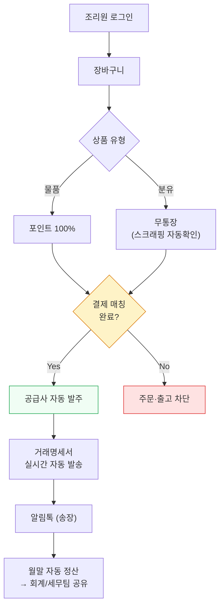
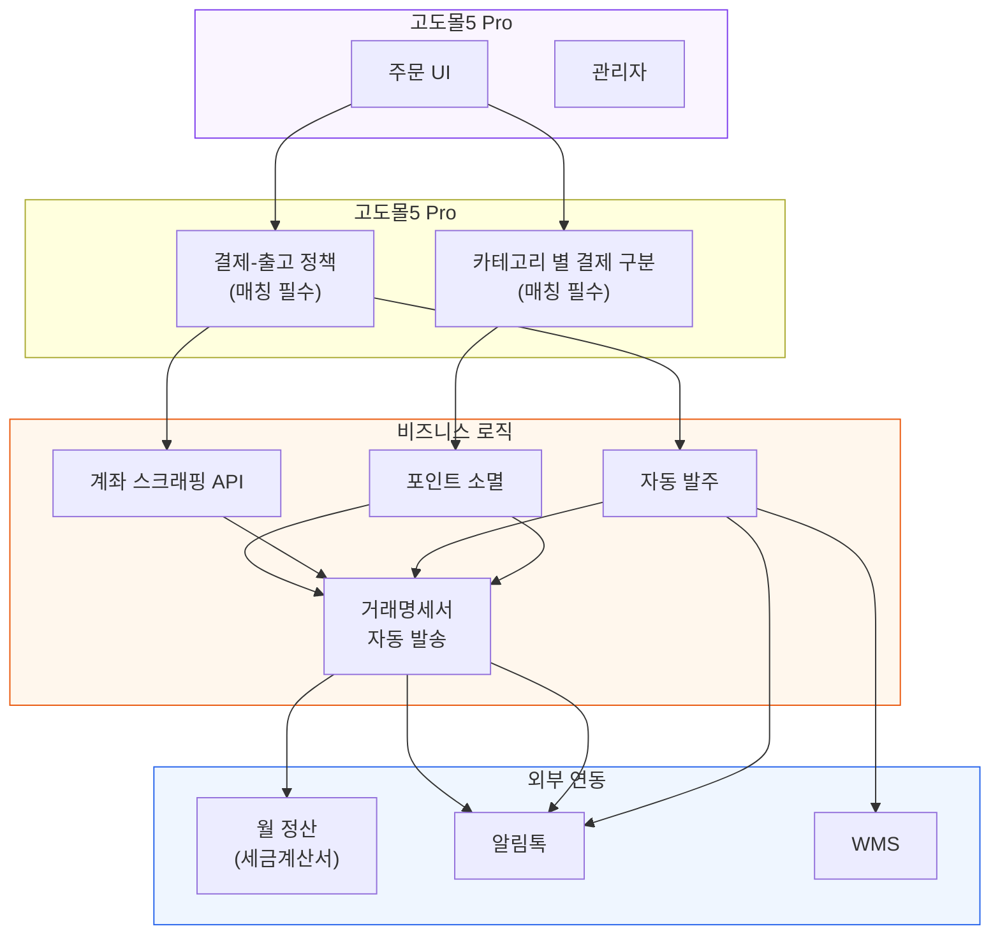

# 1. 문제 정의 및 기획 배경
- --
## 1. 프로젝트 개요
### 문제점 인식
- 전국 140여 개 산후조리원의 분유/물품 주문을 구글 폼 + 수기 엑셀로 운영. 주문·출고·정산 모든 프로세스가 수작업에 의존
- 팀원 2명이 매일 30분씩 주문 확인 후 출고 처리, 매월 1~2일을 수기 정산에 사용
- 수기 계좌이체 확인·매칭 후 출고: 담당자 판단으로 '먼저 출고하고 입금 받는' 등 기존 프로세스를 벗어나는 변수가 빈번. 담당자 피로도 높음
- 거래명세서를 매일 사람이 수기로 작성하여 발송
- 특수 고객(산후조리원)의 높은 CS 강도: 매일 전화로 송장번호, 출고/입고 일정, 상품 재고, 입금 확인 등 반복 문의
- 공급가·매입가 마진 구조상 PG 결제 수수료율을 절대 감당할 수 없는 원가 구조
- 데이터 파편화: 주문(구글 폼), 출고(WMS), 정산(엑셀)이 각각 별도 관리
### 프로젝트 목표
- PG 수수료를 원천 차단하면서도 결제-출고를 자동화하고, 담당자 재량에 의한 변수를 시스템 정책으로 통제
- 파편화된 주문·출고·정산 데이터를 단일 시스템으로 통합하여 데이터 정합성을 확보하고, 국세청 신고용 정산 데이터를 자동 산출

## 2. 진행 과정 및 역할
- --
### 플랫폼 아키텍처 설계
- 고도몰5 Pro 멀티숍 구조 채택: 회원 DB 공유 구조로 별도 SSO 개발 비용 절감
- PG 결제 수수료 원천 차단: 공급가·매입가 마진율 구조상 외부 PG를 의도적으로 배제. 현금성 포인트(물품) + 계좌이체(분유)로 결제 수단을 이원화하고, 계좌 스크래핑 API 기반 무통장 입금 자동 대조·승인 체계 설계
### 결제-출고 정책 전환
- 기존: 수기 입금 확인 → 담당자 판단으로 선출고/후입금 등 변수 허용 → 정산 불일치, 미수금 발생, 담당자 피로
- 전환: '결제 매칭이 완료되지 않으면 주문도, 출고도 불가'라는 확고한 정책을 시스템으로 강제. 담당자 재량에 의한 예외를 원천 차단하여 데이터 정합성과 운영 안정성을 동시에 확보
### 결제 및 발주 자동화 로직
- 카테고리별 하이브리드 결제 라우팅: 장바구니 상품 속성에 따라 결제 수단 자동 분기 (물품: 포인트 100% / 분유: 무통장 자동 확인 / 특정 등급: 별도 정책)
- 공급사 SCM 자동 발주 라우팅: 입금 확인 즉시 해당 공급사에만 주문이 자동 격리 노출. 수기 발주 원천 차단
- 거래명세서 자동 발송: 기존 수기 작성·발송 → 24시간 실시간 자동 발송으로 전환
- 국세청 연동: 현금영수증 자동 발행, 월말 세금계산서 일괄 전자 발행. 정산 데이터 정합성이 확보되어 월 1회 신고를 위한 데이터 추출이 즉시 가능
### CS 부담 흡수 설계
- 조리원 마이페이지에서 주문 이력·송장번호·배송 상태·포인트 잔액·입금 확인 여부를 실시간 조회 → 반복 전화 문의 대폭 감소
- 알림톡 자동 발송(주문 확인, 출고 완료, 송장번호): LMS(건당 3.0P) → 알림톡(건당 0.6P), 비용 80% 절감
### 운영 안정성 확보
- CronJob 스케줄러 기반 월말 포인트 자동 소멸, 마이페이지 사업자번호/주소 임의 변경 방지 백엔드 보안 가드
### 개발사 협업
- 시스템 요건을 코드 레벨(DB 테이블·스킨 파일·컨트롤러)까지 명세하여 개발사 SOW 작성
- 조리원의 오프라인 결제 관행과 당사 출하 로직 간의 간극을 조율하여 복잡한 비즈니스 흐름을 단일 시스템으로 통합

## 3. 결과 및 성과
- --

-** 주문 확인·출고 업무  ** 83% 단축**  |  팀원 2명 × 일 30분 → 5분

-** 월 정산  ** 100% 자동화**  |  월 1~2일 수기 → 0일. 정산, 분석 등 데이터 즉시 추출

-** 결제-출고 정책 전환  ** 변수 원천 차단**  |  담당자 재량 → 시스템 강제. 미수금·정산 불일치 제거

-** 거래명세서  ** 수기 → 실시간 자동 발송**  |  24시간 즉시 발송

-** 메시징 비용  ** 80% 절감**  |  LMS 3.0P → 알림톡 0.6P

-** PG 수수료  ** 0원**  |  마진 구조 보전을 위한 결제 체계 설계
### 정성적 성과
- 반복 CS 문의 대폭 감소: 조리원 담당자가 시스템에서 직접 정보 확인
- 수기 업무 휴먼 에러 해결 및 팀원 부담 해소 
- 파편화 데이터 → 단일 DB 통합: 발주 내역·결제·출고·정산의 데이터 정합성 확보
## 4. 회고
- --
### 교훈
- '수기'에 의존하던 프로세스를 '시스템 정책과 자동화'으로 전환하면, 운영 변수가 사라지고 데이터 정합성이 자동으로 확보됨
- CS 문제는 단순히 응대 인력의 문제가 아니라 정보 접근성의 문제. 시스템으로 해결 가능한 영역이 존재
- PG 수수료 차단은 단순 비용 절감이 아니라, 공급가·매입가 구조상 마진을 지키기 위한 비즈니스 필수 조건이었음
### 개인 성장
- B2B 결제·정산·발주 프로세스를 단일 시스템으로 통합 설계하는 경험
- 오프라인 관행(선출고/후입금)과 시스템 정책 간의 간극을 조율하며 현업을 설득하는 PM 역량
- 외부 개발사를 기술적으로 리드하며 프로젝트를 완수

## 5. Reference
- --
## 주문 → 결제 라우팅 → 출고 플로우

## 시스템 아키텍처

## B2B 폐쇄몰 시연 화면

  
  

