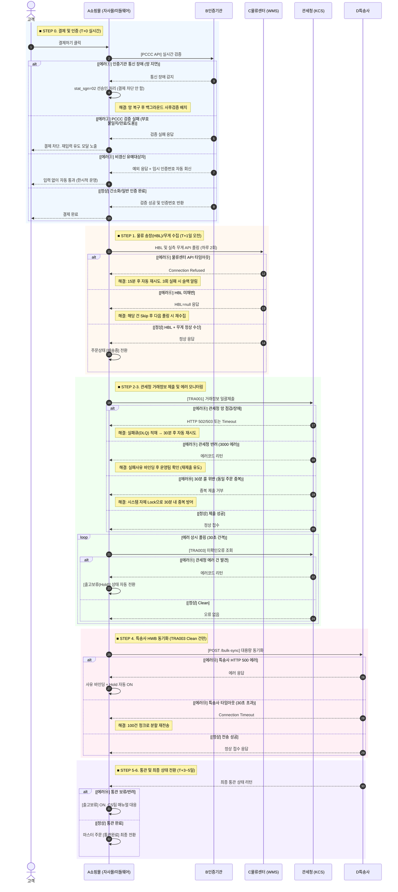

# 관세청 전자상거래 통관플랫폼 연동 — 전사 공유 기획 보고서

>  최종 업데이트: 2026-07-21 | PM: OOO

---

## 1. 프로젝트 개요 및 협업 구조

### 1.1 배경 및 목표
관세법 개정안에 따라, 전자상거래업체는 소비자 결제 시점에 개인통관고유부호(PCCC)를 **실시간 검증**하고, 거래정보를 관세청에 **사전 자동 제출**해야 함. 미이행 시 스마트통관 제외로 통관 지연 및 과태료 위험이 존재함. 본 프로젝트는 5개로 분산된 외부 시스템을 하나의 미들웨어로 통합 제어하는 것이 목표임.

### 1.2 기초 정보
| 항목 | 내용 |
|---|---|
| 법적 근거 | 관세법 제254조의2 개정안 |
| 대상 플랫폼 | A쇼핑몰 (자사몰) |
| 전자상거래업체부호 | **K******** (마스킹)** |
| 대상 상품 | 해외직구 전 품목 |

### 1.3 참여 업체 및 역할 (5개사 통합)
| 업체 | 역할 | 주요 통신 및 협력 포인트 |
|---|---|---|
| **자사 기획팀** | 통합 PM 및 아키텍처 설계 | 유관 부서(CS, 물류) 운영 정책 수립 |
| **A개발사** | API 미들웨어 및 프론트 개발 | 백엔드 허브, 3-Track 로직, 큐(Queue) 연동 구현 |
| **B인증기관** | 본인인증 · 통관검증 중계 | 결제 실시간 PCCC 인증 API 연동 |
| **C물류센터** | 해외 WMS 창고 관리 | 매일 송장/무게 데이터 Polling 연동 |
| **D특송사** | 통관 · 특송 및 EDI 전송 | 거래정보 최종 검증 및 세관 EDI 대행 연동 |

---

## 2. 시간대별 데이터 통합 시퀀스 다이어그램

고객 결제부터 관세청 거래정보 제출, 특송사 연동, 그리고 최종 통관 상태 반영에 이르는 **전체 데이터 흐름과 에러(예외) 대응 시나리오**임.

---

## 3. 유관 부서 소통 및 선제적 방어 정책 (Risk Defense)

이 프로젝트는 기술적 구현을 넘어, 타 부서와의 사전 합의를 통해 발생 가능한 운영 리스크를 원천 차단한 것이 핵심임.

### 3.1 CS팀 협업: "Point of No Return" 및 수동 개입 차단
- **배경**: 관세청 시스템에는 **제출된 거래정보를 취소하거나 삭제하는 API가 아예 존재하지 않음.** 송장이 채번되고 `[상품준비중]`이 된 이후에 고객이 결제를 취소하면 시스템과 세관 데이터가 심각하게 꼬이게 됨.
- **방어 및 정책 수립**:
  1. **단순 취소 차단**: CS팀과 사전 합의하여, `[상품준비중]` 이후의 단순 취소 버튼을 기술적으로 블록하고 **"수령 후 해외 왕복 배송비 고객 부담의 반품"**으로 운영 프로세스를 전환함.
  2. **수동 송장 수정 원천 차단**: CS 담당자가 어드민에서 송장번호 텍스트만 강제로 수정하는 것을 차단함. 송장 변경 시 반드시 전용 **[재제출] 버튼**을 눌러 관세청과 특송사에 새 송장을 동시 재전송하도록 시스템 프로세스를 강제하여 데이터 정합성을 지켰습니다.

### 3.2 물류/운영팀 협업: 관세청 3000 에러 선제적 방어
- **분할 배송 오차 보정 (물류팀)**: 부피 문제로 주문을 여러 박스로 나눌 때, 각 송장의 금액(USD)을 분할하는 과정에서 소수점 오차가 발생하면 세관에서 세액 불일치로 반려(3000 에러)됨. 이를 방지하기 위해 **마지막 박스에 잔여 차액을 일괄 할당하여 100% 일치시키는 자체 보정 로직**을 기획함.
- **30분 룰 자체 Lock 방어 (운영팀)**: 관세청은 동일 주문번호를 30분 내 중복 제출 시 서버 자체를 블록함. 운영팀이 실수로 재제출 버튼을 여러 번 누르는 경우를 대비해, **시스템 레벨에서 자체 Lock을 걸어 중복 트래픽을 선제적으로 Drop**시켰습니다.

### 3.3 매출 하락 방어: 본인인증(B기관) 장애 시 Failover
- **매출 방어 로직 (선승인)**: 결제 트래픽이 몰리는 시점에 본인인증 기관의 망이 뻗거나 지연되면 고객은 결제를 포기함. 이를 방어하기 위해 타임아웃 발생 시 결제를 차단하지 않고 **`stat_sgn=02` 플래그로 일단 선승인 통과**를 시켰습니다.
- **사후 검증 큐**: 선승인 된 건들은 백그라운드 스케줄러가 인증 기관이 복구된 후 Rate Limit(10 TPS 이하)에 맞춰 조용히 사후 검증(PER003)을 진행하도록 하여 매출 이탈을 방어함.

---

## 4. 시스템 무결성을 위한 API 제어 (Dev & AQ)

관세청과 같은 외부 낡은 인프라와의 연동은 잦은 Timeout과 502/503 에러를 유발함. 이를 극복하기 위해 설계된 안정성 확보 장치들임.

| 로직명 | 대상 API | 핵심 역할 및 기대 효과 |
|---|---|---|
| **Dead-Letter Queue (DLQ)** | 관세청 `TRA001` 일괄제출 | 네트워크 장애(5xx) 시 즉각 실패 처리하지 않고, 실패큐에 적재 후 **지수 백오프(Exponential Backoff)를 통해 30분 뒤 자동 재시도**하여 데이터 유실 0% 달성 |
| **청크 분할 (Chunking)** | D특송사 `bulk-sync` 동기화 | 대량 동기화 시 30초 Timeout이 발생하면 즉시 트랜잭션을 롤백하고, **100건 단위로 청크를 쪼개어 순차 재전송**하는 복원력(Resilience) 확보 |
| **비동기 폴링 (Polling)** | 관세청 `TRA003` 오류조회 | 관세청에 제출된 내역의 오류를 데몬 스레드가 상시 감지하여 어드민 `[출고보류]` 상태로 자동 롤백 및 실패 사유 바인딩 자동화 |
| **단건조회(TRA002) 차단** | 관세청 API 전체 | 단건조회 호출 시 TRA003 에러 큐 데이터가 영구 소멸되는 관세청 망의 치명적 단점을 파악하여, **개발자 디버깅 용도를 제외하고 시스템 내 자동 호출 전면 금지** |

---

## 5. 배포 전 체크리스트 (종합 리스크 검증)

라이브 전, 예외 케이스 및 타 부서 영향도를 종합 점검하는 체크리스트임.

- [ ] **Track A/B 분기 무결성**: 수하인/주문자 일치 시 간소화 패스, 불일치 시 SMS 인증창 정상 분기 확인
- [ ] **인증기관 지연 Mocking**: 3170 에러 고의 유발 시 결제가 차단되지 않고 선승인 처리 되는지 점검
- [ ] **레이스 컨디션 방어**: C물류센터 배치 수집과 내부 상태 변경 로직이 겹칠 때 DB 데드락이 발생하지 않는지 확인
- [ ] **수동 변경 강제 블록**: 어드민에서 DOM 조작으로 송장을 억지 수정해도 백엔드에서 100% Validation 튕겨내는지 점검
- [ ] **[재제출] 트랜잭션 롤백**: 새 송장 등록 3단계(채번→관세청→특송사) 중 마지막 통신 실패 시 앞 단계가 안전하게 롤백되는지 확인
