# 관세청 전자상거래 통관플랫폼 연동 — 전사 공유 기획 보고서

>  최종 업데이트: 2026-07-19 (D-27) | PM: 박종혁

- --

## 1. 프로젝트 개요

### 1.1 배경 및 목표

2026년 8월 15일 시행되는 관세법 제254조의2 개정안 에 따라, 전자상거래업체는 소비자 결제 시점에 개인통관고유부호(PCCC)를 실시간 검증 하고, 거래정보를 관세청에 사전 자동 제출 해야 한다. 미이행 시 스마트통관 제외 → 목록통관 전환으로 통관 지연이 발생하며, 과태료 및 블랙리스트 등재 위험이 있다.

### 1.2 기초 정보

| 항목 | 내용 |
|---|---|
| 법적 근거 | 관세법 제254조의2 개정안 (2026.08.15 시행) |
| 대상 쇼핑몰 | 뉴트리시아몰 (고도몰5 기반) |
| 전자상거래업체부호 | K26000127(2026.06.01 승인) |
| 대상 상품 | 압타밀(해외직구) / 포티멜(해외직구) |
| 계약 총액 | ₩32,413,815 (부가세 별도) — 1차 ₩17,013,815 + 2차 ₩15,400,000 |

### 1.3 참여 업체 (5개사)

| 업체 | 역할 | 담당자 |
|---|---|---|
|(+)아이베 / 크로네| 원청 · 기획 · PM | 박종혁 리드 |
| 긱스튜디오| 개발사 | 강명제 팀장, 김동섭 엔지니어 |
| NICE평가정보| 본인인증 · 통관검증 중계 | 신용철 매니저 (DI사업1실) |
| 옌타이 동수 (Dongshu)| 중국 물류창고 WMS | 공부장, 안과장 |
| 자이언트네트워크그룹| 통관 · 특송사 | 김현진 연구원 |

- --

## 2. 참조 가이드라인 및 버전

| 연동 기관 | 문서 정식 명칭 | 적용 버전 | 비고 |
|---|---|---|---|
| 관세청 | 관세청 전자상거래 전용 REST API 명세서 | v1.4(26년 5월 개정) | AUT, PER, TRA 전체 |
| NICE평가정보 | 통관 스마트 검증 API 개발 가이드 (CI 활용기관) | v1.0| SMARTPCC_11/20/30 |
| NICE평가정보 | 통관 스마트 검증 API 개발 규격_260515.pdf | v1.0 | 암복호화 샘플 |
| 자이언트 | GGATE API V2 (자이언트네트워크그룹 신고 API) | v1.2.0(26.06.10) | HWB 단건/벌크/조회 |
| 관세청 | 04 전자문서항목정의서 전자상거래물품 통관목록(DKX) | v1.0 | 특송사용 EDI 서식 |
| 관세청 | 03. 개인통관고유부호 체계 개선(안) | v1.0 | OTP/rspn_tp:03 예외처리 |
| 관세청 | 01. 회원가입 및 전자상거래업체부호 등록 | v1.0 | API 사용신청 절차 |

- --

## 3. 시간대별 물류 + 데이터 통합 흐름도 

고객이 결제 버튼을 누르는 순간부터, 데이터가 어떤 API를 통해 어디로 흐르고, 물리적 화물이 어디에 있는지를 시간순으로 정리한다.

####  전체 데이터 흐름 및 단계별 시각화

```mermaid
sequenceDiagram
    autonumber
    actor C as 고객
    participant G as 뉴트리시아몰 (고도몰/Geek)
    participant N as NICE평가정보
    participant D as 동수 (WMS)
    participant K as 관세청 (KCS)
    participant Z as 자이언트 (Giant)

    rect rgb(240, 248, 255)
    Note right of C: ■ STEP 0. 결제 및 인증 (T+0 실시간)
    C->>G: 결제하기 클릭
    G->>N: [SMARTPCC_11] PCCC 실시간 검증
    alt [에러①] NICE/관세청 통신 장애 (3170 에러)
        N-->>G: 통신 장애 감지
        G->>G: stat_sgn=02 선승인 처리 (결제 차단 안 함)
        Note right of G: 해결: 망 복구 후 PER003(SMARTPCC_30) 사후검증 배치
        Note right of G: 3170이면 CS가 수동 확인 후 고객에게 PER001 재인증 알림톡
    else [에러②] PCCC 검증 실패 (부호 불일치/만료/도용)
        N-->>G: 검증 실패 응답
        G-->>C: 결제 차단. 재입력 유도 모달 노출
        Note right of G: 해결: 고객이 PCCC 재입력하거나 관세청 사이트에서 부호 재발급
    else [에러③] 비갱신 유예대상자 (rspn_tp:03)
        N-->>G: 03 응답 + 임시 인증번호 6자리 자동 회신
        G-->>C: 입력 없이 자동 통과 (27년 12월까지 한시적)
        Note right of G: 주의: 2027.12.31 이후 이 경로 폐쇄됨
    else [에러④] Track B SMS 미수신/세션 만료
        N-->>G: SMS 발송 완료 but 고객 미입력
        G-->>C: 인증 모달 타임아웃
        Note right of G: 해결: 재인증 UX 흐름으로 전환 (재발송 버튼)
    else [정상] Track A(구매간소화) 또는 Track B(인증완료)
        N-->>G: 검증 성공 및 Track(A/B) 반환 + 인증번호 6자리
        G-->>C: 결제 완료 (p1)
    end
    end

    rect rgb(255, 248, 240)
    Note right of G: ■ STEP 1. 동수 HBL/무게 수집 (T+1일 11:00~12:00)
    Note over G, D: 매 영업일 11:00 동수 수집 / 11:30, 12:00 Geek 폴링
    G->>D: HBL 및 실측 무게(Weight) API 폴링 (하루 2회)
    alt [에러⑤] 동수 API 타임아웃/응답 없음
        D-->>G: 타임아웃 또는 Connection Refused
        Note right of G: 해결: 15분 후 자동 재시도. 3회 실패 시 Slack 알림 + 수동 확인
    else [에러⑥] HBL 미채번 (동수 내부 오류)
        D-->>G: HBL=null 응답
        Note right of G: 해결: 해당 건은 Skip하고 다음 폴링 시 재수집. 동수 담당자 연락
    else [에러⑦] 무게(Weight) 값 NULL/이상값
        D-->>G: weight=null 또는 음수
        Note right of G: 해결: 기본값 0.0 적재 후 Flag 마킹. 운영팀 수동 확인 대상
    else [정상] HBL + 무게 정상 수신
        D-->>G: 송장번호(HBL) 및 무게 정상 응답
        G->>G: 주문상태 [배송중] 전환 (Point of No Return - 취소 불가)
    end
    end

    rect rgb(240, 255, 240)
    Note right of G: ■ STEP 2-3. 관세청 거래정보 제출 및 에러 모니터링
    Note over G, K: HBL 수신 즉시 자동 트리거
    G->>K: [TRA001] 거래정보 일괄제출 (최대 300건/3MB)
    alt [에러⑧] TRA001 제출 자체 실패 (네트워크/관세청 점검)
        K-->>G: HTTP 502/503 또는 Connection Timeout
        Note right of G: 해결: 실패큐(Dead-letter)에 적재 → 30분 후 자동 재시도
    else [에러⑨] 관세청 3000 에러 (txif_sbmt_no 중복 또는 필드 오류)
        K-->>G: 3000 에러코드 리턴
        Note right of G: 해결: txif_sbmt_no 신규 채번 후 재제출. 필드 오류 시 117/118번에 사유 적재
    else [에러⑩] 30분 룰 위반 (동일 ord_no 30분 내 중복)
        K-->>G: 중복 제출 거부
        Note right of G: 해결: ord_cmpl_dttm 비교하여 시스템 자체 방어. 30분 경과 후 재제출
    else [정상] TRA001 제출 성공
        K-->>G: 정상 접수
    end

    loop TRA003 30초 간격 상시 폴링 (50건/큐)
        G->>K: [TRA003] 미확인오류 조회
        alt [에러⑪] 관세청 에러 건 발견 (필드 불일치/인증 만료 등)
            K-->>G: 에러코드 + 상세사유 리턴
            G->>G: [출고보류(Hold)] 자동 ON + 실패리스트(117/118번) 적재
            Note right of G: 해결: 운영팀 엑셀 다운 → 원인 파악 → [재제출] 버튼 (새 txif_sbmt_no)
        else [정상] Clean (unread_cnt=0)
            K-->>G: 오류 없음. 30초 Sleep 후 재폴링
        end
    end
    end

    rect rgb(255, 240, 245)
    Note right of G: ■ STEP 4. 자이언트 특송사 전송 (TRA003 Clean 건만)
    Note over G, Z: TRA003 정상(Clean) 건만 전송
    G->>Z: [POST /bulk-sync] 자이언트 HWB 동기화 (동기식)
    alt [에러⑫] 자이언트 HTTP 500/400 에러
        Z-->>G: 에러 응답 (상세사유 포함)
        G->>G: 117/118번에 에러사유 TRUNCATE 바인딩 + Hold ON
        Note right of G: 해결: 에러 원인 수정 후 [재제출]로 자이언트에도 동시 재전송
    else [에러⑬] 자이언트 타임아웃 (30초 초과)
        Z-->>G: Connection/Read Timeout
        Note right of G: 해결: 100건 청크로 분할 재전송. 지속 시 자이언트 담당자 연락
    else [정상] 전송 성공
        Z-->>G: 정상 접수 응답
    end
    end

    rect rgb(245, 240, 255)
    Note right of G: ■ STEP 5-6. 통관 및 최종 상태 전환 (T+3~5일)
    Note over Z, K: 자이언트 주도 - 수입신고서(DKW/DKX) 세관 EDI 전송
    Note over G, Z: 물리적 상품 준비(출고) 기준 T+3영업일
    G->>Z: 최종 통관 결과 상태 폴링
    alt [에러⑭] 통관 보류/반려 (세관 심사 불통과)
        Z-->>G: 통관 보류/반려 상태 리턴
        G->>G: [출고보류(Hold)] ON. CS팀 수동 대응 (고객 연락)
        Note right of G: 해결: 원인별 대응 - 정보불일치: 재제출 / 검역: 서류 보완 / 도용: 신고
    else [에러⑮] 송장 탈거로 HBL 변경 (동수 재발급)
        Z-->>G: 기존 HBL과 적하목록 불일치 감지
        G->>G: 기존 건 Hold
        Note right of G: 해결: CS가 [재제출]로 새 HBL 등록 → TRA001+자이언트 동시 재전송
    else [정상] 통관 완료
        Z-->>G: 통관 완료 상태 리턴
        G->>G: 분할배송 시 모든 HBL 완료 확인 후 최종 [통관완료] 전환
    end
    end
```

> [시스템 예외 처리 안내] 위 다이어그램의 [에러①~⑮]는 라이브 환경에서 발생 가능한 주요 예외 케이스임. 각 에러 항목의 해결 프로세스에 따라 시스템이 자동 대응하거나 CS팀의 매뉴얼 대응이 필요함.

### STEP 0. 고객 결제 (실시간, T+0초)

| 항목 | 내용 |
|---|---|
| 화물 위치 | 중국 옌타이 동수 창고에 재고로 있음 |
| 트리거 | 고객이 뉴트리시아몰에서[결제하기] 버튼 클릭 |
| API 호출 순서 | ① NICE `SMARTPCC_11` 호출 (CI 추출 + 관세청 PER001 대체 검증) → ② Track 분기 → ③ 결제 승인 → ④ 고도몰 주문 생성 `[결제완료]` |
| 소요시간 | 2~5초 (실시간) |

 Track 분기 상세:

| Track | 조건 | 동작 | 고객 경험 |
|---|---|---|---|
| A (구매간소화)| 주문자 = 수하인 (CI 일치, `reqt_tp:02`) | 백그라운드에서 자동인증. 인증번호 6자리가 백엔드로 즉시 회신. | 입력 없이 프리패스 |
| B (일반인증)| 주문자 ≠ 수하인 또는 CI 불가 (`reqt_tp:01`) | SMS/알림톡으로 인증번호 발송. 고객이 6자리 직접 입력. | 인증번호 입력창 노출 |
| 예외 (03)| 비갱신 유예대상자 (`rspn_tp:03`) | 관세청이 임시 인증번호 6자리를 즉시 회신. | 입력 없이 자동 통과 |

> [인증 Track 분기] Track A(본인 구매)는 추가 입력 없이 통과되며, Track B(타인 선물 등)는 수하인이 직접 인증해야 함. 비갱신자(03)의 경우 관세청 지침에 따라 2027년 12월 31일까지 시스템에서 자동 통과 처리됨.

 장애 시 예외 처리 (PER003 사후검증):
- 관세청/NICE 망이 다운된 경우, 결제를 차단하지 않고 `stat_sgn=02`로 선승인 처리
- 망 복구 후 NICE `SMARTPCC_30` API로 사후 검증 배치 실행 (초당 10건 이하 Rate Limiting)
- `call_dttm` 필드에 장애 발생 시각을 필수 기입
- 만약 `3170` 에러 (세관이 아닌 당사 내부 망 지연으로 판단) → CS 수동 확인 대기 + 고객에게 PER001 재인증 유도 알림톡 발송

> ️[3170 에러 대응] 3170 에러는 관세청 망이 아닌 당사 시스템 또는 구간 네트워크 지연으로 판단되는 에러임. 이 경우 기 선승인된 주문에 대해 CS 부서의 수동 확인 및 고객 재인증 안내가 필요함.

- --

### STEP 1. 동수 창고 데이터 수집 및 HBL 채번 (T+수시간 ~ T+1일)

| 항목 | 내용 |
|---|---|
| 화물 위치 | 중국 옌타이 동수 창고에서 피킹/포장 진행 중 |
| 트리거 | 매 영업일 11:00 동수 WMS가 공식몰 `p1`(결제완료) 건들을 수집 |
| API 호출 | ① 동수 WMS 수집 후 HBL(송장번호) 채번 및 패킹 시작 → ② 공식몰(Geek) 스케줄러가 11:30 / 12:00 (하루 2회) 동수 API를 호출하여 채번된 HBL과 상품의 실측 무게(Weight) 수신 → ③ 고도몰 DB에 HBL 및 무게 적재 |
| 상태 전환 | 고도몰 주문 상태: `[결제완료]` →`[상품준비중]`|

 동수 데이터 수집 규칙 (7월 확정):

| 규칙 | 상세 |
|---|---|
| 수집 기준 | `orderGoodsData` 내의 `orderStatus`를 최종 판단 기준 으로 사용 (마스터 주문 상태 아님) |
| 수집 대상 | 오직 `p1`(결제완료)만 수집 |
| 수집 금지 | `g1`(상품준비중): 이미 WMS로 넘어간 건이므로 중복수집 시 이중출고 대형사고|
| 자동 폐기 | `c`(취소), `r`(환불), `f`(결제실패) 코드가 섬여 있으면 동수 WMS가 자동 Drop |
| 동수 테스트 제약 | Staging에서 실서버 데이터가 리턴됨. 15~18시에만 테스트 가능. `ord_no` 수동 삽입 필요 |

 분할 배송 발생 시 (1주문 → 복수 HBL):

| 필드 | 처리 방식 |
|---|---|
| `hbl_no` | 박스별 HBL 번호 각각 고유하게 1:1 매핑 |
| `ord_no` | 최초 자사몰 주문번호 동일하게 유지(관세청 1주문-복수 HBL 허용) |
| `itemSeq` | 해당 박스에 실제 적재된 상품만 선별하여 `001, 002` 형태로 재생성|
| 금액 |[해당 박스 실적재 수량 × 상품별 USD 고정 공급단가] 로 분기 연산 |

> [분할 배송 신고 원칙] 부피 문제 등으로 분할 배송 시, 주문번호는 동일하게 유지하되 각 박스에 적재된 실제 금액과 수량을 분할하여 관세청에 별도 신고해야 함. 미준수 시 세액 불일치(3000 에러)로 반려됨.

- --

### STEP 2. 관세청 거래정보 제출 (T+1일, HBL 적재 직후 트리거)

| 항목 | 내용 |
|---|---|
| 화물 위치 | 동수 창고에서 포장 완료, 선적 대기 또는 항공 적재 준비 중 |
| 트리거 | 11:30, 12:00 배치로 HBL이 DB에 적재되는 즉시 TRA001 배치 자동 트리거 (이후 실패건은 실패리스트에 적재) |
| API 호출 | 관세청 `TRA001` (거래정보 일괄제출) |
| 제약사항 | 최대 300건 배치. Body 최대 3MB. 30분 룰 방어 (`ord_cmpl_dttm` 저장) |

 TRA001 주요 파라미터 및 주의사항:

| 파라미터 | 값 | 주의 |
|---|---|---|
| `txif_sbmt_no` | 21자리 신규채번 | ️ 재제출 시 반드시 새로 채번(3000 에러 방어) |
| `sale_ents_sgn` | K26000127 | 업체부호 |
| `sale_ents_id` | Staging: K26000127 / Prod: Null| ️ Prod 배포 시 반드시 Null로 원복 |
| `elcm_pcd` | A | 독립자사몰 직접판매 |
| `prod_unprc_curr_cd` | USD | 고정 |
| `ord_amt_curr_cd` | USD | 고정 |
| `cscl_agcs` | Null | 통관대행료 제외 |
| `ord_prod_nm` | 국문 상품명 그대로 | 옵션 제거, 일반 상품명만 |

- --

### STEP 3. 에러 모니터링 및 확인 (T+1일~, TRA001 제출 직후부터 상시)

| 항목 | 내용 |
|---|---|
| 화물 위치 | 중국 → 인천 이동 중 (항공/해운) |
| 트리거 | TRA001 제출 직후부터 상시 폴링 |
| API 호출 | 관세청 `TRA003` (미확인 오류 조회 큐 폴링) |
| 동작 | 50건 단위 큐 조회. `unread_cnt=0`이면 30초 Sleep 후 재시도 |

 오류 발생 시 자동화 흐름:
1. TRA003에서 에러 건 발견
2. 고도몰 어드민에`[출고보류(Hold)]` 플래그 자동 세팅 → 동수 창고 송장 출력 원천 차단
3. 에러 코드 및 사유를 고도몰 순정 양식 117번(사유), 118번(상세사유) 필드에 자동 바인딩
4. 운영팀이 실패 리스트 엑셀 다운로드 → 원인 파악 → 어드민에서[재제출] 버튼 클릭 (txif_sbmt_no 신규 채번)

> ️[TRA002 호출 주의] TRA002(단건조회)를 선호출할 경우 TRA003 큐에서 해당 건이 소멸됨. TRA002는 예외적인 디버깅 목적으로만 제한적으로 사용해야 함.

- --

### STEP 4. 자이언트 특송사 데이터 전송 (TRA003 Clean 확인 후)

| 항목 | 내용 |
|---|---|
| 화물 위치 | 중국에서 인천으로 이동 중 또는 인천 입항 대기 |
| 트리거 | TRA003에서 에러 없음 확인된(Clean) 건만 전송 |
| API 호출 | 자이언트 `POST /api/hwb/bulk-sync` ( 동기식) |
| 응답 처리 | 즉시 리턴되는 에러 코드/상세를 실시간 파싱 → 고도몰 117/118번에 다이렉트 바인딩 |

 자이언트 전송 필드 고정값:

| 필드 | 값 | 비고 |
|---|---|---|
| `shipperName` | 동수 (DONGSHU E-BUSINESS)| 실물 발송 근거지인 중국 현지 창고명 (일양로지스 아님) |
| `domesticCarrierName` | 롯데택배| 국내 배송사 |
| `brokerCode` | K26000127(9자리 고정) | 전자상거래업체부호 |
| `brokerName` | 뉴트리시아몰 | 등록된 상호명 |
| `pccCode` | 13자 고정 (P로 시작) | 개인통관고유부호 |
| `tempAuthNo` | 6자 고정 | 일회용 인증번호 |
| `sellerName` | 뉴트리시아몰 | 직구(A) 유형 = 쇼핑몰명 |
| `qtyUnit` | EA | 고정 |

- --

### STEP 5. 인천 입항 → 통관 → 국내 배송 (T+2~4일)

| 항목 | 내용 |
|---|---|
| 화물 위치 | 인천항/공항 입항 → 세관 창고 반입 → X-ray 검사 → 통관 심사 |
| 데이터 흐름 | 자이언트가 당사가 제출한 거래정보(TRA001)+HWB 데이터를 기반으로 수입신고서(DKW)/통관목록(DKX)을 세관에 EDI 제출 |
| 역할 구분 | DKW/DKX 제출은 자이언트(특송사)의 역할. 당사는 REST API로 거래정보/인증만 담당 |
| 통관 완료 후 | 국내 택배사(롯데택배)로 인계 → 고객 배송 |

### STEP 6. 통관 결과 확인 및 최종 상태 전환 (T+3~5일)

| 항목 | 내용 |
|---|---|
| 화물 위치 | 통관 심사 완료 후 국내 택배망을 통해 고객 배송 중 |
| 통관 결과 폴링 | 물리적인 상품 준비(출고 예정/완료) 후 3일(T+3일) 시점 에 자이언트 API를 호출하여 최종 통관/배송 상태 결과값 수신 |
| 고도몰 상태 전환 | 통관 통과 및 분할 배송 건의 경우, 쪼개진 모든 HBL이 최종 출고 완료 판정을 받았을 때만 마스터 주문 상태를 최종`[통관완료]` 로 일괄 전환 |
| 이유 | 고도몰 DB 구조상 개별 송장 단위로 상태값을 제어할 수 없음 (sno 단위로만 상태 매핑) |

> [통관 상태 안내] 배송중 상태 전환 후 3~5일 내에 통관이 완료되면 시스템에서 자동으로 [통관완료] 상태로 업데이트 됨.

- --

## 4. 기능별 상세 매칭 (API 가이드라인 ↔ 개발 요구사항)

### 4.1 인증 체계 (PER/AUT)

| 가이드 | 기능 | 상태 | 운영 비고 |
|---|---|---|---|
| 관세청 v1.4 AUT | AUT001 토큰발급 / AUT002 폐기 |  | OAuth 2.0, 24시간 자동갱신. 계정당 최대 3개 인가키 |
| NICE v1.0 | SMARTPCC_11 (PER001 대체) |  | Track A/B 자동분기. 비갱신자(03) 허용. AES/GCM/NoPadding 복호화 |
| NICE v1.0 | SMARTPCC_20 (PER002 대체) |  | 주소/연락처 변경 시 재검증. TRA001 이후 호출 차단 |
| NICE v1.0 | SMARTPCC_30 (PER003 대체) |  | 장애 시 선승인 후 사후검증. 10TPS 제한. 3170 에러 시 CS 수동 |

### 4.2 거래정보 (TRA)

| 가이드 | 기능 | 상태 | 운영 비고 |
|---|---|---|---|
| 관세청 v1.4 | TRA001 거래정보 일괄제출 |  | 최대 300건, Body 3MB. txif_sbmt_no 21자리 신규채번 |
| 관세청 v1.4 | TRA002 단건조회 |  | ️ 예외용만. 선호출 시 TRA003 큐 데이터 영구소멸 |
| 관세청 v1.4 | TRA003 미확인오류 폴링 |  | 50건 큐. unread_cnt=0이면 30초 Sleep. 조회기간 7일 제한 |
| UNIPASS API041 | (구) PCCC 검증 |  | 8/15 이후 완전 중단 → PER001로 대체 |

### 4.3 동수 WMS 연동

| 가이드 | 기능 | 상태 | 운영 비고 |
|---|---|---|---|
| 동수 협의(7월) | 공식몰 주도형 Outbound Polling |  | p1만 수집, g1/c/r/f 제외 |
| 동수 협의 | 1회 조회 100건 제한, 초과 시 청크분할 |  | 출고일자+HBL 모두 있는 건만 항공발송 전환 |
| 동수 협의 | 분할배송 연산 규칙 |  | [실적재 수량×USD 고정단가]. 소수점 누적오차 리스크 존재 |

### 4.4 자이언트 연동

| 가이드 | 기능 | 상태 | 운영 비고 |
|---|---|---|---|
| GGATE v1.2.0 | HWB 벌크 동기화 (`POST /api/hwb/bulk-sync`) |  | E2E 대기 |
| GGATE v1.2.0 | 동기식 응답 실시간 파싱 → 117/118번 바인딩 |  | 비동기 배치 기각됨 |
| GGATE v1.2.0 | 통관이상 배치 폴링 (HWB+3영업일부터 조회) |  | DB 상태 적재 + 어드민 필터 연동 |
| 자이언트 협의 | 교환 건은 TRA 재제출 불요 (CS 수동) |  | 스마트통관을 위해 TRA제출은 필수 |

### 4.5 어드민 및 프론트엔드 기획

| 기획 | 기능 | 상태 | 운영 비고 |
|---|---|---|---|
| 쿠팡형 UI(7.1) | 체크박스 제거, 원클릭 동의 |  | 개인정보 및 결제 동의 UI 미변경 상태. 프론트엔드 최우선 작업 필요|
| Hold 자동화(7.7) | TRA003/자이언트/PER003 실패 시 자동 ON |  | 2일 공수 |
| 실패리스트(7.2) | 117/118번 바인딩. 저장≠송출 분리. 재제출 시 txif_sbmt_no 신규채번 |  | 4일 공수 |
| 취소차단(6.3) | 취소/환불 주문 TRA001 배열에서 Drop |  | orderGoodsData. orderStatus 기준 |
| USD/HS코드(7.6) | 별도 DB 신설, 엑셀 벌크 업로드 |  | 1일 공수 |
| 영문정보(7.3) | 영문주소: 행안부 API. 영문성명: 로마자 추천+수동입력 |  | Papago 기각. 2일 공수 |
| 상품명(7월) | 옵션 제거, 일반 상품명만 제출 |  | v1.4 지침 충족 |

- --

## 5. 운영 정책

### 5.1 계도기간 및 2027년 유예 정책

| 정책 | 기간 | 상세 |
|---|---|---|
| 임시인증번호(Z99999)| 2026.08.15 ~ 2026.09.15| 오픈 후 1개월간 인증번호 대신 `Z99999`를 TRA 및 수입신고서에 기재 가능. 9/16부터 전면 불가. |
| 협력인정업체 시범적용| 2026.08.15 ~ 2027.01.31| 정식 지정 전이라도 CI 수집 요건을 갖추면 Track A 구매간소화 특례 시범 적용. 당사는 NICE 연동으로 해당. |
| 정식 지정 신청 개시| 2027.01.01~| 정식 등록 신청 접수 시작. 세관 승인 10일 이내. |
| 유예 종료| 2027.02.01 이후| 정식 협력인정업체만 Track A 유지. 미등록 시 혜택 완전 종료. |

 협력인정업체 등록 요건 (고시 제10조):
1. 전자상거래업자 등록 완료
2. 직전 반기 거래정보 제출 정합성 95% 이상(HBL번호, 주문번호, 업체부호 일치 기준)
3. 최근 1년 내 PCCC 도용 처벌 없을 것
4. 최근 1년 내 개인정보보호법 과징금/고발 없을 것
5. 본인확인기관(NICE)을 통해 CI 취득 가능 상태일 것

> ️[데이터 정합성 유지] 계도기간부터 TRA001을 통한 거래정보를 성실히 제출하여 정합성 95% 이상을 유지해야 협력인정업체 승인이 가능함. (반기별 평가 미달 시 특례 적용 정지)

### 5.2 취소/환불 정책 (Point of No Return)

| 시점 | 취소 가능 여부 | 처리 방식 |
|---|---|---|
| 결제전 |  가능 | 일반 취소 |
| 결제완료 ~ 상품준비중 전 |  가능 | 취소 처리, TRA001 배열에서 Drop |
| 상품준비중 (HBL 채번 후)|  불가| 무조건 수령 후 반품 프로세스 (해외 왕복배송비 고객 부담) |

### 5.3 송장 재발급 및 재제출 운영 정책

통관 과정 중 송장 탈거(파손/분실) 등으로 인해 새로운 HBL 송장번호가 재발급되는 경우 의 CS 운영 원칙임.
- 수동 송장 업데이트 차단: 고도몰 주문 상세에서 CS팀이 송장번호만 단순 수정/업데이트하는 행위는 시스템 차원에서 원천 차단 함. (단순 업데이트 시 관세청에는 과거 송장으로 제출된 상태로 남아 데이터가 심각하게 꼬입니다)
- 전용 [재제출] 기능 사용 의무화: 새로운 송장번호 발급 시, 반드시 어드민에 마련된 전용[재제출] 기능 을 통해서만 송장을 갱신해야 함.
- 재제출 시나리오 동작 흐름: CS팀이 [재제출]을 통해 새 송장 입력 시 → 시스템이 새 `txif_sbmt_no` 자동 채번 → 관세청 `TRA001`에 새 송장으로 재전송 → 성공 시 자이언트 `bulk-sync` 에도 동시 재전송 됨.

- --

## 6. 배포 전 체크리스트 (QA 및 리스크 검증)

라이브 오픈(8/15) 및 실서버 이관(8/5) 전, 모든 시스템이 정상적으로 돌아가는지 확인하기 위한 종합 QA 및 리스크 체크리스트임.

### 6.1 프론트엔드 및 인증 (NICE)
- [ ] UI 변경 확인: 결제 및 개인정보 동의 UI(쿠팡형 원클릭) 정상 노출 여부
- [ ] Track A/B 분기 테스트: 수하인=주문자(Track A 간소화), 수하인≠주문자(Track B SMS 인증) 정상 분기 확인
- [ ] 예외 케이스(03) 테스트: 비갱신 대상자(03) 입력 시 임시 인증번호(Z99999 등) 우회 통과 확인
- [ ] NICE 망 장애(3170) 테스트: 모달 세션 타임아웃 및 세관 지연 시 `stat_sgn=02` 선승인 후 사후검증(PER003) 전환 확인

### 6.2 동수 창고 (WMS) 및 분할 배송 (개발 레벨 상세 체크)
- [ ] 100건 대량 배치 송수신 및 JSON 파싱: 동수 WMS `p1` 100건 배치 처리 시 JSON Body Parsing Exception 없이 100% 맵핑되는지 점검
- [ ] 무게(Weight) API NULL 대응: 실측 무게값이 NULL 또는 문자열 파싱 에러로 떨어질 경우 기본값 0.0 처리 혹은 예외 처리 여부
- [ ] 레이스 컨디션 및 트랜잭션: 동수 배치와 고도몰 상태 전환 타이밍 충돌 시 DB 트랜잭션 락/데드락 발생 없이 g1 수집 방어 여부
- [ ] 분할 배송 소수점 로직: 분기 연산 시 `Float/Double` 오차 방어 로직 (마지막 HBL에 차액을 무조건 할당하여 마스터 총액과 정확히 일치 검증)

### 6.3 관세청 (TRA) 및 자이언트 연동 (Timeout & Payload)
- [ ] API 응답 타임아웃(Timeout) 엣지 케이스: 관세청 TRA001 / 자이언트 동기화 시 10초 이상 지연(Connection/Read Timeout) 발생 시 재시도(Retry) 또는 Dead-letter 큐 적재 로직 확인
- [ ] TRA001 30분 룰 강제 테스트: 동일 `ord_no` 30분 내 중복 방어가 실제 `ord_cmpl_dttm` 컬럼 비교를 통해 완벽히 Drop 되는지 검증
- [ ] 자이언트 에러 응답 파싱: 자이언트 HTTP 500/400 에러 시 Response Body 내의 상세 사유가 고도몰 117/118번 컬럼의 VARCHAR 길이 제한을 초과하지 않고 안전하게 바인딩(TRUNCATE) 되는지 점검
- [ ] 3일 후(T+3) 폴링 스케줄러 데몬: 배송 시작 후 +3 영업일 뒤 자이언트 폴링 스케줄러가 데몬으로 안정적으로 돌면서 `[통관완료]`로 일괄 전환하는지 서버 로그 검증

### 6.4 어드민 제어 및 CS 정책
- [ ] 수동 송장 변경 차단 무결성: 어드민에서 꼼수(DOM 조작/패킷 탬퍼링)로 송장번호를 강제 수정하더라도 백엔드 API 단에서 막아내는지(Validation) 점검
- [ ][재제출] 다중 트랜잭션 성공/실패 롤백: 새 송장 등록 시 [새 채번 → TRA001 제출 → 자이언트 전송] 3단계 트랜잭션 중 중간에 터졌을 때(ex: TRA001 성공, 자이언트 실패) 데이터 불일치를 방어할 롤백/Hold 로직 확인

### 6.5 시스템 및 인프라 (8/5 실서버 이관용)
- [ ] `sale_ents_id` 원복: Staging(K26000127)에서 Prod(Null) 로 변경 확인
- [ ] 방화벽 ANY 오픈 확인: 관세청 통합테스트 전 방화벽 정상 오픈 여부 확인 (Prod: `103.87.116.64`)
- [ ] OAuth 인증 토큰(AUT001): 24시간 토큰 자동 갱신 실패 시(만료) 재시도 로직이 백그라운드에 구현되어 있는지 점검
- [ ] TLS 1.3 통신 확인: 관세청 및 자이언트 서버와 TLS 1.3 통신이 정상적으로 맺어지는지 점검

- --

## 7. 예상 리스크 및 대응 방안 (Risk Management)

| # | 카테고리 | 예상 리스크 | 배경 | 예상 영향 | 대응 방안 |
|---|---|---|---|---|---|
| 1 | 테스트 | TRA003 Silent Failure (사각지대)| 테스트 환경에서 관세청 에러를 강제로 유발할 방법이 없음 | 오픈 후 통관 반려 사실을 며칠 뒤에야 인지. 대형 고객 컴플레인 | 오픈 후 최소 2주간 매일 오전/오후 개발사+운영팀 교차 대사 작업 |
| 2 | 테스트 | 동수 WMS Staging = 실서버| 동수 테스트 환경이 실서버 데이터를 리턴하며, 15~18시에만 테스트 가능 | 통합 테스트 시간 제약으로 충분한 QA 불가 | ord_no 수동 삽입으로 우회 + E2E는 집중 시간대 배정 |
| 3 | 인프라 | 방화벽 ANY 오픈 미확정| 관세청이 통합테스트 전 방화벽 ANY 오픈 시점을 별도 통보 예정이나 아직 미통보 | 방화벽 미오픈 시 연동 테스트 자체 진행 불가 | 관세청 eccs@korea. kr 주간 단위 일정 재확인 메일 발송 |
| 4 | 인프라 | 관세청 서버 에러 시 (점검/장애)| 관세청 정기 점검이나 예고 없는 서버 장애 발생 시 TRA001/TRA003 전면 불통 | 실패리스트 대량 적재, 신규 주문 거래정보 제출 전면 지연 | 실패큐(Dead-letter) 적재 → 서버 복구 후 자동 일괄 재처리. 2시간 이상 장기 장애 시 운영팀 수동 전환 |
| 5 | 연동 | 동수-고도몰 상태 레이스 컨디션| 동수 배치와 고도몰 주문 상태 전환의 타이밍 충돌 | 치명적인 이중출고 (대형 물류사고) | 초기 1주간 매일 DB 대사 스크립트 실행. p1→g1 전환 시 DB 락으로 방어 |
| 6 | 연동 | 연휴/명절 후 배치 폭주| 공휴일 연휴 후 적체된 수십~수백 건이 한꺼번에 배치 | TRA001 300건/동수 100건 제한으로 병목, 서버 OOM 또는 Gateway Timeout | 배치 간 30초 간격 + 청크 단위 순차 실행 |
| 7 | 연동 | 자이언트 500건 벌크 미검증| GGATE API가 단건→500건 확장되었으나 실제 대량 테스트 미진행 | 응답 지연/타임아웃으로 전건 실패 처리 | 100건 청크 + 타임아웃 30초 방어 + 자이언트 김현진 연구원과 사전 부하 테스트 협의 |
| 8 | 데이터 | 분할배송 소수점 누적오차| USD 단위 소수점 버림 연산이 누적되면 마스터 총액과 불일치 | 세액 불일치로 관세청 반려 (3000 에러) | 마지막 박스에 나머지 차액 일괄 할당 로직 구현 완료. QA 검증 필수 |
| 9 | 데이터 | 30분 룰 Edge Case| 동일 ord_no로 30분 이내 재제출 시 관세청이 자동 거부 | TRA001 대량 반려 발생 가능 | ord_cmpl_dttm 저장하여 시스템 자체 방어 + 관세청에 공식 질의 예정 |
| 10 | CS/운영 | 송장 탈거 후 CS 오대응| CS 직원이 [재제출]을 사용하지 않고 송장만 메모/수동 수정할 경우 | 적하목록과 불일치로 통관 전면 보류 + 과태료 대상 | 수동 변경 시스템 차단 + CS 스크립트 및 어드민 운영 가이드 교육 |
| 11 | CS/운영 | 분할배송 CS 문의 폭주| 고도몰은 마스터 단위 상태 제어만 가능하여 "송장은 떴는데 배송중으로 안 바뀐다" | CS 대응 시간 폭증 | CS 스크립트에 분할배송 안내 사전 명시. 알림톡 자동 발송 |
| 12 | 인증 | NICE 모달 세션 타임아웃| 고객이 인증창을 오래 놓아두면 세션 만료되어 결제 자체가 무산 | 이탈률 상승 + CS 폭주 | 재인증 UX 흐름 구현(재발송 버튼) + 안내 문구 |
| 13 | 인증 | NICE AES/GCM 복호화 키 변경| NICE 측에서 암호화 키를 사전 통보 없이 갱신할 경우 | SMARTPCC_11 전면 장애 → 결제 전면 차단 | NICE 신용철 매니저와 키 변경 통보 SLA 사전 합의 |
| 14 | 정책 | 계도기간 종료 후 미대응 (9/16~)| 계도기간(8/15~9/15) 종료 후 Z99999 임시인증번호 전면 불가 | 미갱신 고객 결제 실패 폭주 | 9/1부터 미갱신 고객 대상 사전 알림톡 캠페인. 고객 안내 배너 강화 |
| 15 | 정책 | 95% 정합성 미달 → 협력인정업체 탈락| 반기별(1월/7월) 관세청 평가에서 거래정보 정합성 95% 미달 시 | Track A(구매간소화) 특례 6개월 정지. 모든 고객 Track B로 강제 전환 → UX 악화 | 계도기간부터 TRA001 제출 정확도 모니터링 대시보드 운영. 월간 정합성 리포트 자체 생성 |

- --

## 8. 개발사 (Geek Studio) 시연 항목

### 7.1 결제창 인증 유형별 시연 (3건)

| # | 시연 유형 | 테스트 조건 | 확인 포인트 |
|---|---|---|---|
| 1 | 갱신용 (일반 SMS, Track B)| 주문자 ≠ 수하인 또는 CI 불일치 | SMS 인증창 노출 → 6자리 입력 → 검증 통과 |
| 2 | 구매간소화용 (Track A)| 주문자 = 수하인, CI 일치 | 입력창 없이 자동 통과 (프리패스) |
| 3 | 비갱신용 (예외 케이스)| rspn_tp:03 응답 대상자 | 입력창 없이 자동 통과 (03 예외 처리) |

### 7.2 백엔드/어드민 제어 시연 (2건)

| # | 시연 항목 | 제약사항 | 확인 포인트 |
|---|---|---|---|
| 1 | 실패 건 수동 재제출| TRA003 강제 에러 유발 불가능 → 과거 실패 이력 샘플 활용 | 재제출 버튼 클릭 → 새 txif_sbmt_no 채번 확인 → 정상 접수 |
| 2 | 출고보류(Hold) 플래그 자동세팅| 에러 발생 시 자동으로 Hold ON 되는지 확인 | Hold 플래그 상태 확인 + 실패 리스트 엑셀 다운로드 |

- --

## 9. 마일스톤 (7/19 기준)

| Phase | 단계 | 일정 | 현황 |
|---|---|---|---|
| — | 1차 자율테스트 | 04.13~04.24 |  |
| — | API 휴지기 | 04.27~05.01 |  |
| — | 2차 통합테스트 | 05.11~05.22 |  |
| P1 | 코어모듈 기술검증 | ~05.22 |  |
| P2 | 운영환경준비 (업체부호 발급 등) | 06.01~06.04 |  |
| P3 | 외부API연동 (NICE 테스트베드 등) | 06월 |  |
| P4 | 모듈결합 QA (4자망) | 07.01~ |  P5와 병행|
| P5 | E2E 통합테스트 | 07.10~08.04 |  D-27|
| P6 |  실서버 이관 (Prod Deploy)| 2026.08.05|  대기 |
| — | 전사 공유 및 시연 미팅| 다음주|  예정 |
| — |  정식 오픈 (Live)| 2026.08.15|  D-27 |

- --

## 10. 고정 파라미터 레퍼런스

| 파라미터 | 값 | 설명 |
|---|---|---|
| elcm_pcd | A | 독립자사몰 직접판매 |
| sale_ents_sgn | K26000127 | 업체부호 |
| sale_ents_id | Staging:K26000127 / Prod:Null| ️ 원복필수 |
| prod_unprc_curr_cd | USD | 고정 |
| ord_amt_curr_cd | USD | 고정 |
| cscl_agcs | Null | 통관대행료 제외 |
| shipperName | DONGSHU E-BUSINESS | 중국 현지 창고명 |
| domesticCarrierName | 롯데택배 | 국내 배송사 |
| brokerCode | K26000127 | 9자리 고정 |
| qtyUnit | EA | 고정 |

- --

