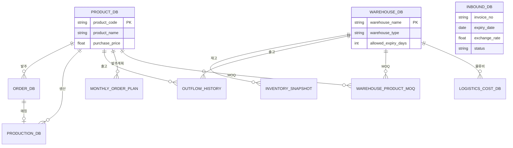
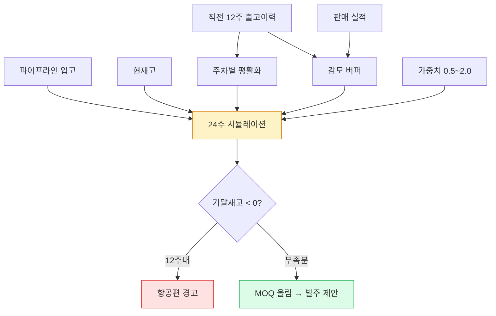
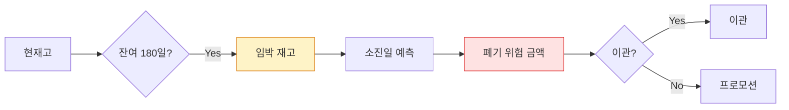

# 1. 문제 정의 및 기획 배경
- --
## 1. 프로젝트 개요
### 문제점 인식
- 수입 분유의 발주-입고 리드타임이 6개월 이상으로, 품절 시 즉시 대응이 불가능하며 과재고 시 유통기한 폐기 리스크가 상존
- 기존 재고 관리: 엑셀 파일 기반 수기 관리. 수십 개 채널의 판매·입출고 데이터가 별도 시트로 분산되어 실시간 현황 파악 불가
- PO 발행 시 환율 변동에 따른 재고 자산 가치를 수동 계산. 담당자가 바뀌면 수식이 깨지는 구조적 문제
- 수요 예측 부재: 매일 1시간씩 수기로 재고 확인·회전율 계산, 주 2시간씩 발주-생산-입고 매칭·재고자산 평가를 수행. 과거 판매량만으로 경험적 발주를 진행하여 품절/과재고가 반복
### 프로젝트 목표
- 파편화된 엑셀 데이터를 단일 DB로 통합하고, 수요 예측·FEFO 역산·재고 시뮬레이션을 자동화하여 데이터 기반 발주 의사결정 체계를 확립
- 수기로 파일을 만들고 편집하는 반복 업무를 제거하고, 정해진 양식만 업로드하면 즉시 데이터화·계산·시뮬레이션이 되는 구조를 구현

## 2. 진행 과정 및 역할
- --
### 기술 스택 선정 및 아키텍처 설계 (단독)
- Python 3.11 / FastAPI / Uvicorn: 경량 비동기 웹 프레임워크. 로컬 환경에서도 빠른 응답 속도 확보
- SQLite 3: 별도 DB 서버 없이 파일 기반 동작. IT 인프라 의존도 제거 (별도 서버 비용/승인 불필요)
- Pandas / NumPy: 수요 예측 연산 및 데이터 변환 처리
- Tailwind CSS / Chart. js: 실무자가 직관적으로 확인할 수 있는 대시보드 UI
### DB 스키마 설계 (오버엔지니어링 방지)
- 3차 정규화(3NF) 기반 독립 테이블 설계: 마스터 정보(상품·채널·공급사), 입출고 트래킹, 파이프라인(PO 진행 상태), 인보이스별 환율 정보를 각각 분리
- PO-Invoice 근삿값 매칭 알고리즘: PO와 Invoice 간 다대다 관계를 처리하는 매칭 로직. 복잡한 ERD 없이 실무에 필요한 수준으로 설계
### 핵심 비즈니스 로직
- 24주 수요 예측 및 수요 평탄화 엔진: 과거 판매 데이터 기반 채널별 24주 수요 예측. 극단적 편차 보정으로 1년치 발주 예정량 산출
- FEFO 역산 로직: 유통기한과 채널별 판매 속도를 역산하여 '이 재고는 몇 주 안에 소진되어야 하는가'를 자동 산출. 채널 간 이관 판단 근거 제공
- 채널별 재고 자산 금액 시뮬레이터: 인보이스별 매입 환율 적용. 다음 PO의 캐시플로우 참고 기준으로 활용
- 이벤트성 과거 데이터 수집·대입 시뮬레이터: 프로모션/시즌 효과를 수요 예측에 반영
### 운영 환경
- Windows 11 작업 스케줄러 기반 자동 구동: 출근 시 자동으로 서버가 기동, 브라우저 접속만으로 최신 데이터 확인
- 보안: 내부 IP 접근 제한. 허가된 사용자만 접속 가능한 구조
- AI 도구를 코딩 보조로 활용하되, 아키텍처 및 비즈니스 로직 설계는 전적으로 자체 수행

## 3. 결과 및 성과
- --
### 정량적 성과
- 파편화된 엑셀 → 단일 DB 통합: 수만 건 데이터의 실시간 연산 및 시각화
- 수요 예측 기반 선제적 발주 체계로 전환: 품절/과재고 리스크 사전 방어
- 재고 확인·회전율 계산: 일 1시간 → 5분(대시보드 조회). 발주-생산-입고 매칭·자산 평가: 주 2시간 → 자동 산출
- 수기 엑셀 파일 생성·편집 불필요: 정해진 양식 업로드만으로 즉시 데이터화 및 시뮬레이션 (업무 효율 증대)
### 정성적 성과
- 팀 운영 도구로 안착: 일 단위로 팀원들이 의사결정에 활용
- '감'이 아닌 '수치'로 발주 논의가 가능해짐: 데이터 기반 의사결정 문화의 기반 마련

## 4. 회고
- --
### 문제 해결: 현업 참여형 설계(Co-Design)
- 초기 도입 후 팀원들의 UI/UX 편의성이 맞지 않아 안착까지 약 2개월 지연. 이후 피드백을 수용하여 수정
- 완벽한 결과물의 일방적 제공보다 핵심 기능 배포 후 사용자와 피드백을 주고받는 방식이 실용적임을 확인
- 팀원들의 정량적 리소스 확보 ⇒ 다음 프로젝트나 프로세스 개선 아이디어 창출 가능
### 개인 성장
- 비즈니스 도메인(SCM)의 요구사항을 기술적 시스템 설계로 변환하는 전체 과정을 단독 경험
- 기술적 완성도보다 현업의 맥락 파악이 우선되어야 함을 체득

## 5. Reference
- --
## 대시보드 KPI 시각화
아래는 대시보드 메인 화면의 24주 수요 예측 시뮬레이션 그래프 컨셉입니다. 실제 운영 스크린샷으로 교체할 예정입니다.

-** 파편화된 엑셀 → 단일 DB 통합  ** 수만 건 데이터의 실시간 연산 및 시각화**


-** 수요 예측 기반 선제적 발주 체계  ** 품절/과재고 리스크 사전 방어**


-** 수기 엑셀 업무 제거  ** 정해진 양식 업로드만으로 즉시 데이터화·시뮬레이션**


## DB 스키마 ERD 



## 수요 예측 엔진 (24주 시뮬레이션)

### 핵심 수식 (forecasting. py)
```python
# 24주 미래 재고 시뮬레이션 공식
예상기말재고(W) = (
    전주기말재고
    + 파이프라인_입고
    + 입고예정
    - (주간수요 × weight_factor + 감모버퍼)
)

# 주간수요: 직전 12주 단순 출고량 평균 → 24주 Flat 상수
# 감모버퍼: (1/12) × Σ(단순출고량 - 순수판매량)
# weight_factor: 실무자 수동 조절 (0.5 ~ 2.0)
# 항공편 트리거: W+12 재고 < 0 시 경고
```
## FEFO 유통기한 역산

### 기술 스택
- Backend: Python 3.11 / FastAPI 0.115 / SQLAlchemy 2.0
- Database: SQLite WAL (11 tables, 3NF)
- Frontend: Jinja2 SSR + Vanilla JS + Chart. js 4.4
- 인증: JWT + bcrypt (12시간 토큰)
- 스케줄러: APScheduler (3시간 자동 백업)
- 엑셀 I/O: pandas + openpyxl (6종 양식)

## 시스템 UI 스크린샷

<div style="display:grid; grid-template-columns: 1fr 1fr; gap: 1rem;">
  
  
  
  
</div>

