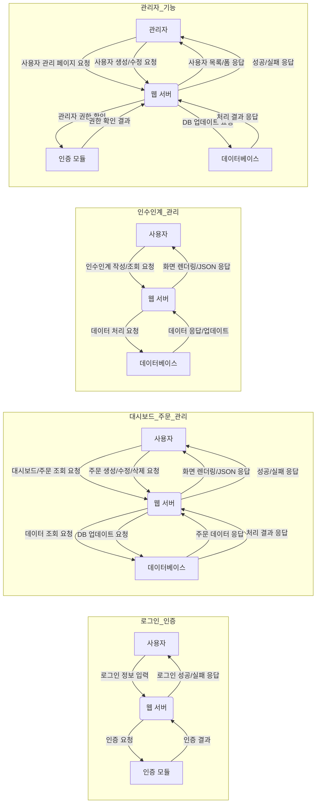
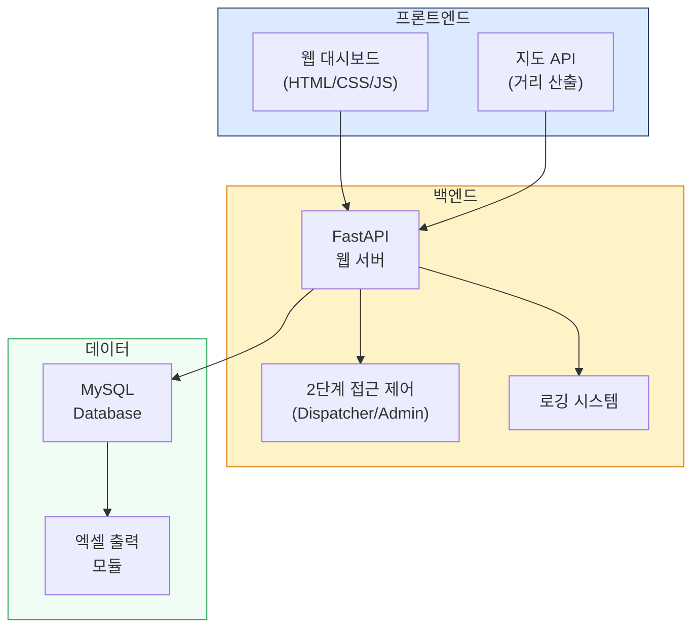
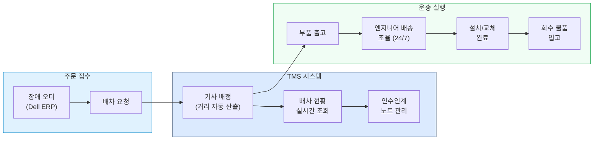
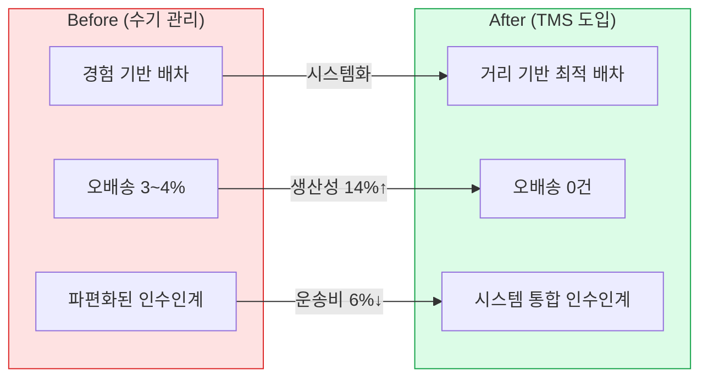

# 1. 문제 정의 및 기획 배경

- --

  <a href="https://github. com/park-jjong/TWLKRTMS-releaseRepository" target="_blank" class="reference-link">
    <svg xmlns="http://www. w3.org/2000/svg" viewBox="0 0 24 24" fill="none" stroke="currentColor" stroke-width="2" stroke-linecap="round" stroke-linejoin="round"><path d="M15 22v-4a4.8 4.8 0 0 0-1-3.5c3 0 6-2 6-5.5.08-1.25-.27-2.48-1-3.5.28-1.15.28-2.35 0-3.5 0 0-1 0-3 1.5-2.64-.5-5.36-.5-8 0C6 2 5 2 5 2c-.3 1.15-.3 2.35 0 3.5A5.403 5.403 0 0 0 4 9c0 3.5 3 5.5 6 5.5-.39.49-.68 1.05-.85 1.65-.17.6-.22 1.23-.15 1.85v4"/><path d="M9 18c-4.51 2-5-2-7-2"/></svg>
    GitHub Repository
  </a>
  <a href="https://www. youtube. com/watch?v=uegOVSqd4lU" target="_blank" class="reference-link">
    <svg xmlns="http://www. w3.org/2000/svg" viewBox="0 0 24 24" fill="none" stroke="currentColor" stroke-width="2" stroke-linecap="round" stroke-linejoin="round"><path d="M2.5 17a24.12 24.12 0 0 1 0-10 2 2 0 0 1 1.4-1.4 49.56 49.56 0 0 1 16.2 0A2 2 0 0 1 21.5 7a24.12 24.12 0 0 1 0 10 2 2 0 0 1-1.4 1.4 49.55 49.55 0 0 1-16.2 0A2 2 0 0 1 2.5 17"/><path d="m10 15 5-3-5-3z"/></svg>
    System Video Reference
  </a>
  <a href="/projects/tms-driver-productivity" class="reference-link">
    <svg xmlns="http://www. w3.org/2000/svg" viewBox="0 0 24 24" fill="none" stroke="currentColor" stroke-width="2" stroke-linecap="round" stroke-linejoin="round"><path d="M14 2H6a2 2 0 0 0-2 2v16a2 2 0 0 0 2 2h12a2 2 0 0 0 2-2V8z"/><polyline points="14 2 14 8 20 8"/><line x1="16" y1="13" x2="8" y2="13"/><line x1="16" y1="17" x2="8" y2="17"/><polyline points="10 9 9 9 8 9"/></svg>
    기사 생산성 분석 원리
  </a>

- --

## 1. 프로젝트 개요
### 문제점 인식
- 기존 운송 프로세스의 분산 및 수작업 중심 인수인계 방식은 심각한 비효율을 초래함.
- 개인 편의에 따른 인수인계 파편화로 정보 누락, 소통 오류, 업무 연속성 저해 발생.
- 월별 긴급 배송 프로세스 중 오퍼레이션 담당의 실수로 인한 오배송 전체 3~4% 발생
### 벤치마킹 및 아이디어 도출
-“Detrack” 서비스 시스템을 벤치마킹하여 대시보드 형태의 테이블 기반 주문 관리 및 날짜별 조회, 엑셀 출력 기능의 효율성을 확인.
- TWLKR의 배송 운영을 시스템으로 표준화하고 중앙 집중화하는 아이디어를 구체화함.
### 프로젝트 목표
- TMS(운송관리시스템) 기획·개발을 통한 전사적 운송 프로세스 혁신 및 운영 효율성 극대화.
- 세부 목표
	- 분산 프로세스 표준화, 인수인계 시스템화, 실시간 배송 추적 및 데이터 기반 관리, 사용자 편의성 제고를 통한 시스템 조기 안착.

## 2. 진행 과정 및 역할

- --

### 주요 기능 및 서비스 정의
- 대시보드 기반 주문 관리 시스템 구현 (Detrack 벤치마킹): 날짜별 조회, 검색, 상세 정보 확인 및 상태 업데이트 기능 제공.
- 체계적인 인수인계 커뮤니케이션 시스템 도입: 인수인계 노트 작성, 조회, 관리 기능 제공.
- 2단계 접근 제어 시스템 구축: 일반 사용자(Dispatcher)와 관리자(Administrator) 역할에 따른 권한 부여.
- 도착지별 거리 및 소요시간 정립 
웨이하우스별로 도착지 우편번호를 기준 거리와 예상 소요시간을 데이터들을 중첩시켜 평균 중위값을 자동으로 측정하여 예상 소요시간 리드타임 표준 정립
	- 거리는 naverapi를 이용 하여 실시간으로 4가지 (실시간빠른길, 편한길, 최단거리, 무료우선 중)  2번째로 긴 거리를 선정
### 프로세스 설계

- 사용자 인터페이스: 웹 브라우저 기반의 직관적인 대시보드 및 관리 화면 제공
- 프론트엔드/백엔드 연동
SSR (Server-Side Rendering) 및 CSR (Client-Side Rendering)을 동시 활용
- 데이터 흐름
사용자 요청은 클라이언트 → 웹 서버(FastAPI) → 인증 모듈/비즈니스 로직
을 거쳐 MySQL 데이터베이스와 연동되며 모든 활동은 로깅 시스템에 기록됨.
### 예상 성과
- 운송 프로세스의 표준화 및 효율 증대.
- 수작업으로 인한 휴먼 에러 및 지연 감소.
- 데이터 기반의 의사결정 지원 및 생산성 향상 기반 마련.
### 팀 구성 및 협업:
- 배송 Operation 팀 기획 및 주도: 경영진 설득을 통해 팀을 구성하고 시스템 단독 개발.
- 팀원 추천 기준: '과묵함'(민감 정보), '꼼꼼함'(데이터 정확성), 'CS 역량 연관성'(고객 중심)을 기준으로 팀원 추천 및 역량 극대화.
### 기술 스택
| 구분 | 기술 스택 | 내용 |
| --- | --- | --- |
| Backend | Python 3.12, FastAPI, Jinja2 | SSR 및 CSR 하이브리드 아키텍처 구축 |
| Frontend | HTML/CSS/JavaScript, Bootstrap/Tailwind | Bootstrap/Tailwind 활용, 모듈형 JS 개발 |
| Database | MySQL 8.0 on Cloud SQL | Cloud SQL 배포, Private IP 연결 |
| Infrastructure | Google App Engine Flexible | Docker 컨테이너 기반 Custom |
### 보안
| 보안 영역 | 구현 내용 |
| --- | --- |
| 네트워크 보안 | • Cloud Armor를 통한 DDoS 및 웹 공격 방어 • Cloud SQL에 Private IP 연결 사용 • 방화벽 규칙을 통한 인가된 소스만 접근 허용 |
| 애플리케이션 보안 | • HSTS, X-Content-Type-Options, X-Frame-Options 헤더 적용 • CSRF 방어를 위한 SameSite=Lax 쿠키 설정 • 모든 보호된 라우트에 대한 서버 측 세션 유효성 검사 • 서버 및 클라이언트 양단에서의 포괄적인 입력값 검증 |
| 데이터 보호 | • Lock 메커니즘을 통한 동시 수정 방지 • 5분 후 Lock 자동 타임아웃 및 해제 • HTTPS를 통한 전송 데이터 암호화 (HTTPS 강제) |
| 인증 및 권한 부여 | • 역할 기반 접근 제어 (USER/ADMIN) • 보안 쿠키를 사용한 세션 기반 인증 • 미인증 접근 시 로그인 페이지로 자동 리디렉션 |
- 주요 활동
	- 프로젝트 기획 및 단독개발: 경영진 설득 및 프로젝트 전반 기획 및 단독 개발
	- 사용자 중심 시스템 안착 지원: 주야간 근무조 동료 대상 개별 코칭을 통한 조기 안착 지원.
	- 저항 극복 및 기능 개선: 지속적인 소통 및 커피챗을 통한 피드백 수렴. '다수 행 선택 배차' 등 핵심 기능 추가 및 불필요한 클릭 UX 감소에 기여.
	- 보안 및 데이터 무결성 강화: 동시 수정 방지(Lock Mechanism) 및 5분 후 자동 타임아웃/잠금 해제 기능 기획 반영.
- 어려움 및 해결
	- 레거시 모델 개선 저항: 동료들의 새 시스템 도입 저항에 직면.
		- 해결: 개별 코칭 및 편안한 대화(커피챗)를 통해 우려 경청 및 핵심 기능 즉시 반영으로 시스템 수용도 제고.
	- 민감 정보 및 데이터 동시성 관리: 보안 및 데이터 무결성 확보의 중요성 인식.
		- 해결: 동시 수정 방지(Lock Mechanism) 및 자동 타임아웃 해제 기능 기획 반영, 다단계 보안 아키텍처 설계.
## 3. 결과 및 성과
- --
### 핵심 성과 지표 (KPI)
- 정량적 성과
	- 주차별 기사 생산성 14% 향상
		⇒ 개발 3개월 전부터 통합 출고 스케줄표를 따로 만들어 적용
그에 따라 총 4개월 정도 데이터와 작년 데이터 대비 향상한 내용
	- 연간 외부 기사 인건비 약 6% 절감 예상(감소 Man-hour 기반 추산)
	- 출발지 별 평균 소요 거리 및 시간 표준 정립 
(데이터가 쌓일수록 정확도 상승)
	- 오배송건 0건 
- 정성적 성과
	- 전사적 운송 프로세스 통일, 커뮤니케이션 오류 감소로 인한 KPI 상승
	- 주요 고객사 배송 최적화를 위한 지역별 기사 스케줄 재정립
### 적용 결과
- 데스크탑 환경 전용, 한국어 최적화, KST (UTC+9) 기준 시간 처리.
- 단순한 시스템 도입을 넘어, 파편화된 출고 업무 구조를 TMS 중심으로 프로세스 재편 ⇒ 물동량 데이터 추출 가공

## 4. 회고
- --
### 개선 방안
- 시스템 안정성 강화
	- 소규모 데이터 처리를 위한 시스템 개발로 인한 안정성 강화 필요
- 외부 ERP와 연동성 생성 필요
### 개인 성장
- 레거시 프로세스 문제 파악, 경영진 설득, 사용자 저항 관리, 시스템 안착 전 과정 주도 경험.
- 사용자 중심 사고 및 지속적인 소통 의 중요성 체득.
- 복잡한 조직 내 변화 관리자로서의 역량 강화 및 인력 관리, 팀 빌딩 실질적 경험 축적.
## 5. Reference
- --
## 시스템 아키텍처

## 운송 프로세스 플로우

## 성과 비교 (Before → After)

	GitHub Repository, 대시보드 실제 스크린샷을 추가해 주세요.

